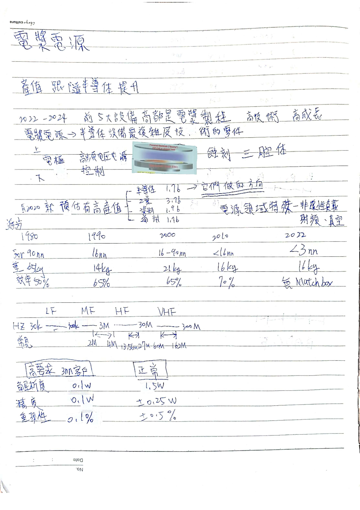
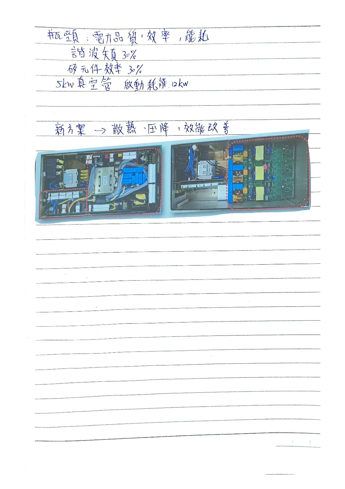

# 半導體電漿電源的演進應用與設計關鍵

演講日期：114/10/07  
演講人：洪再和 總經理  

關鍵字：電漿電源  

---

---
 心得:以實際生產中電漿電源遇到的技術瓶頸為主題，講者說明了目前產業的快速發展與市場需求，也介紹了現階段在散熱與效率上的突破。與虎科的合作讓產品設計更完善，展現出產學合作的實質成果與未來潛力。後來我閱讀了〈Design of Plasma Generator Driven by High-frequency High-voltage Power Supply〉這篇文章，剛好也是本校電機工程系發表的，了解了電漿電源內部主要由高頻逆變器、升壓變壓器以及諧振匹配電路所構成，並且輸出端與電漿負載之間會形成回授影響。透過這篇文章，我更清楚演講者提到的「功率匹配」、「高頻驅動效率」等概念，也對電漿電源的構造和運作方式有了更具體得感覺。
 參考文獻:
 C. Yong-Nong*, K. Chih-Ming, “Design of Plasma Generator Driven by High-frequency High-voltage Power Supply” Energy Procedia, vol. 34, pp. 780–785, 2013. doi: 10.1016/j.egypro.2013.06.808.
