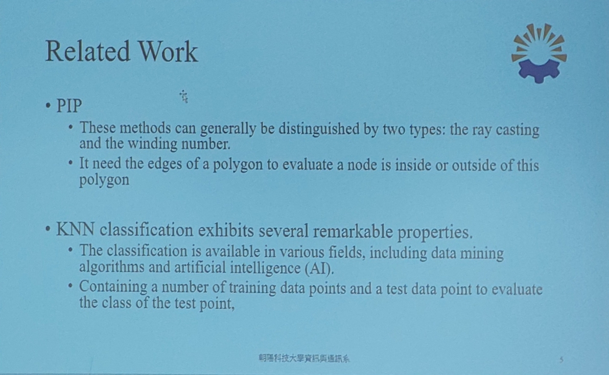
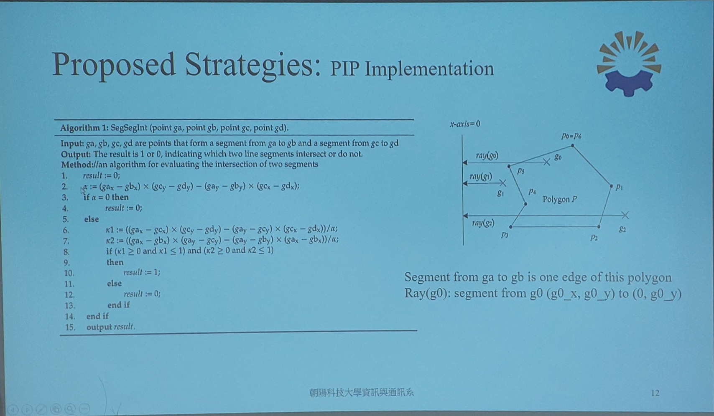

# A Study of Efficient GNSS Coordinate Classification Strategies for Epidemic Management

演講日期：114/10/14 
演講人：陳忠信副教授

目的疫情追蹤
利用 GNSS（全球導航衛星系統）定位資料，結合分類演算法

PIP+
KNN
鄰近點分類新資料點

輸入點座標 形成線段
結果為 1 或 0

1 表示兩線段相交
0 表示不相交

