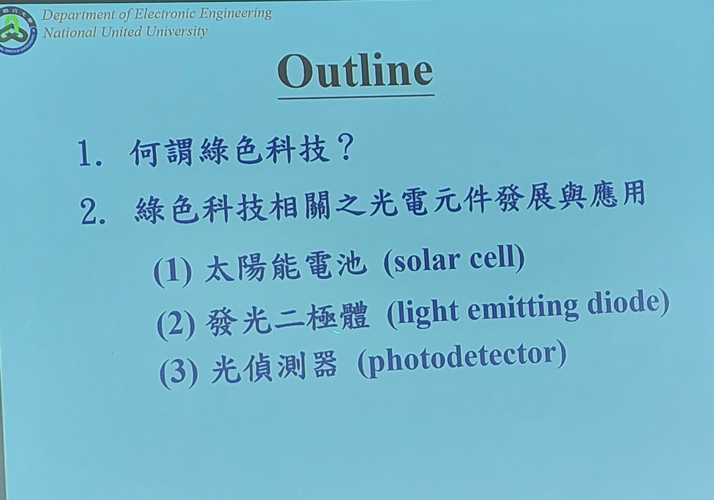
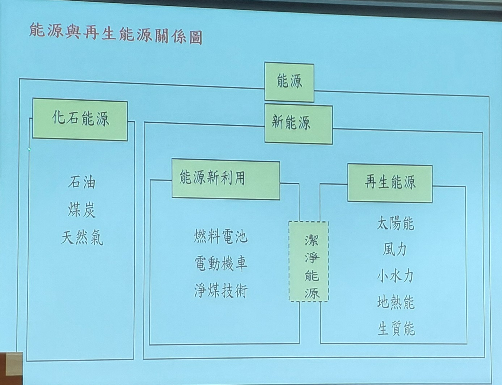
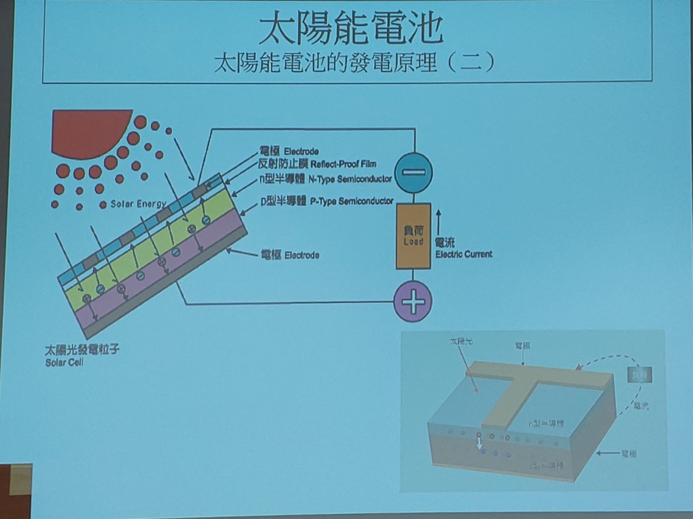
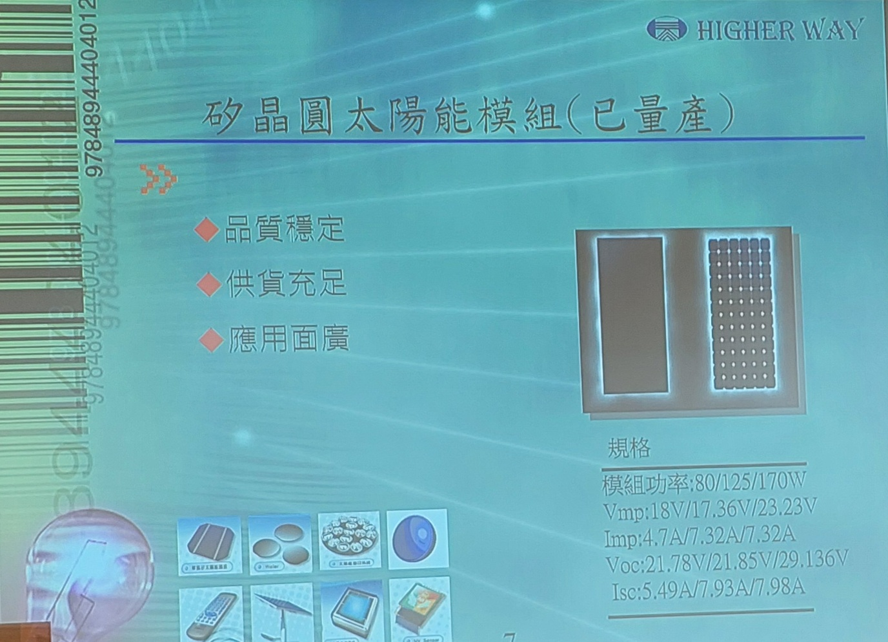
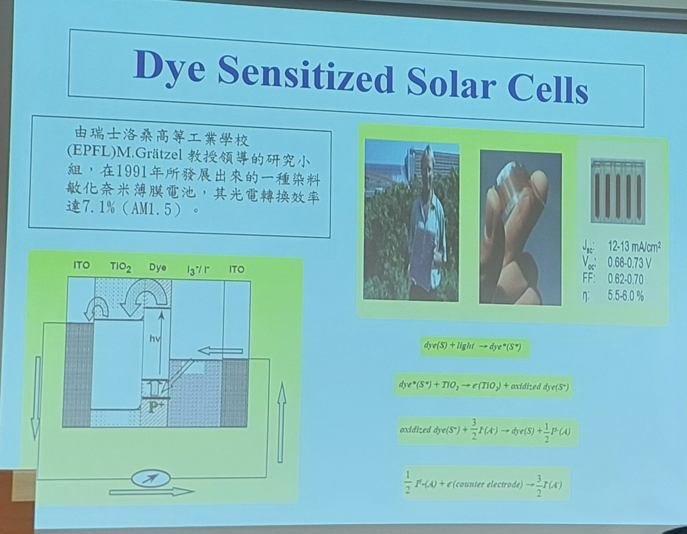

# 綠色科技與光電元件之發展應用
演講者 楊勝州 博士

日期10／21

節能減碳 → 減少能源使用、降低空汙。

綠色科技 節能減碳 降低耗用能源 減少空汙
綠色科技相關的光電元件 太陽能電池(2) 發光二極體 (3) 光偵測器

「能源新利用」與「再生能源」

綠建築 綠建築設計 + 採用光電元件 。

綠建築
被動設計：採光、通風、遮陽、保溫隔熱

主動系統：高效率空調、熱回收、太陽能熱水、LED照明

太陽能電池原理 太陽光打下來產生電子透過外部電路形成電流。
第三代太陽能電池 弱光發電(陰天)

矽晶圓太陽能
目前市場上的主流，其中以單晶矽太陽能板的發電效率最高
薄膜太陽能板在特定應用場景下有其優勢

特別
染料敏化太陽能

用奈米 TiO₂ 傳輸電子，表面吸附染料吸光後產生電子注入；優點是在弱光或散射光下表現較好，製作成本相對可壓低但穩定性、壽命與封裝是挑戰
早期效率範圍低於晶矽，但在陰天、室內弱光場域（IoT 感測節點、窗邊裝置）有應用潛力。
